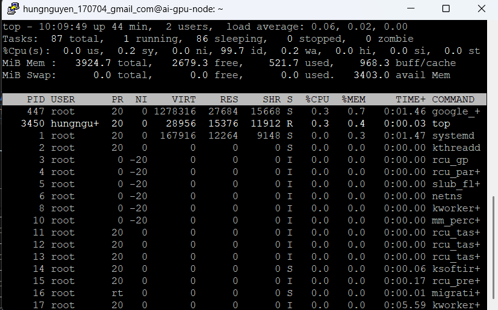
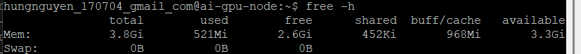
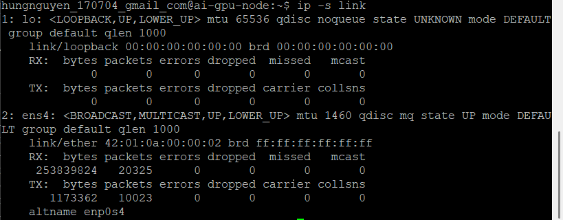
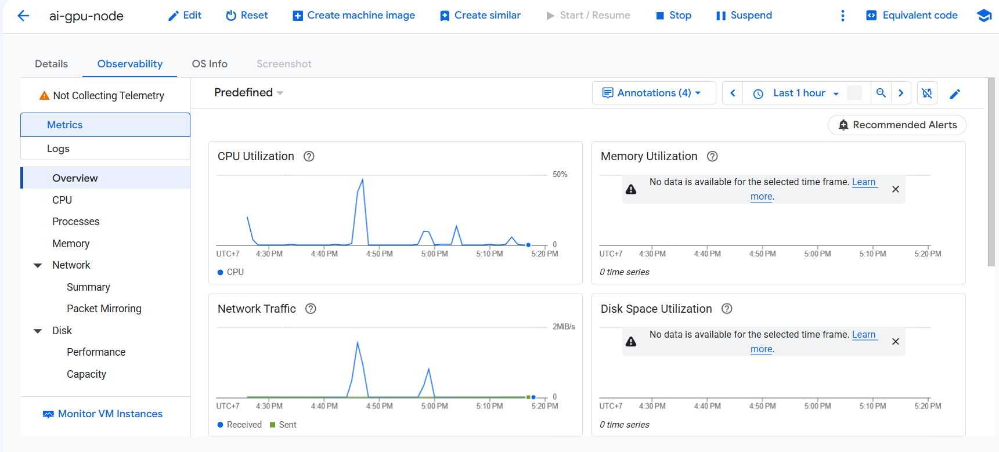
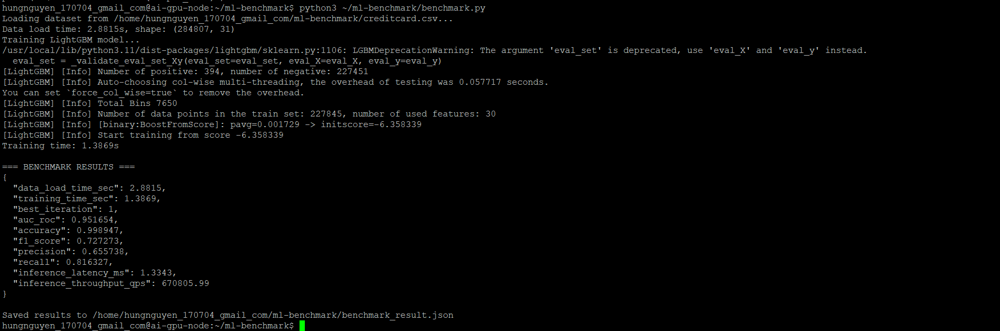

# CHECKLIST THỰC HÀNH LAB 16 (GCP)
> **Dành riêng cho Google Cloud Platform (GCP)**
> *File này tổng hợp thứ tự các bước thực hiện chi tiết từ các tài liệu hướng dẫn của Lab 16.*

---

## 📌 TRẠNG THÁI HIỆN TẠI (ĐÃ HOÀN THÀNH)
- [x] **Cài đặt công cụ Local:** Đã cài đặt thành công `gcloud CLI` (v580.0.0) và `terraform` (v1.15.8).
- [x] **Đăng nhập gcloud:** Đã xác thực tài khoản Google Cloud (`hungnguyen.170704@gmail.com`).
- [x] **Chọn Project ID:** Đã thiết lập active project: `track2-day16-2a202601284`.

---

## 🚀 GIAI ĐOẠN 1: CẤU HÌNH QUYỀN VÀ XÁC THỰC GCP
- [x] **1.1. Cấp quyền Application Default Credentials (ADC) cho Terraform:**
  Chạy lệnh sau trên PowerShell máy cá nhân:
  ```powershell
  gcloud auth application-default login
  ```
- [x] **1.2. Kích hoạt các API bắt buộc trên GCP:**
  Chạy lệnh bật service Compute và IAM:
  ```powershell
  gcloud services enable compute.googleapis.com iam.googleapis.com --project=track2-day16-2a202601284
  ```
- [x] **1.3. Kiểm tra Billing:**
  Đảm bảo Project `track2-day16-2a202601284` đã được liên kết với một Billing Account hoạt động trên [GCP Console Billing](https://console.cloud.google.com/billing).

---

## 🏗️ GIAI ĐOẠN 2: TRIỂN KHAI HẠ TẦNG VỚI TERRAFORM
- [x] **2.1. Di chuyển vào thư mục `terraform-gcp`:**
  ```powershell
  cd terraform-gcp
  ```
- [x] **2.2. Khởi tạo Terraform:**
  ```powershell
  terraform init
  ```
- [x] **2.3. Khai báo biến Project ID và triển khai (Apply):**
  *(Đã chạy `terraform apply -auto-approve` thành công)*.
- [x] **2.4. Lưu lại các giá trị Output:**
  - `gpu_node_name`: `"ai-gpu-node"`
  - `gpu_node_zone`: `"us-central1-a"`
  - `iap_ssh_command`: `"gcloud compute ssh ai-gpu-node --zone=us-central1-a --tunnel-through-iap"`
  - `load_balancer_ip`: `"8.233.226.79"`
  - `api_endpoint`: `"http://8.233.226.79/v1"`

---

## 💻 GIAI ĐOẠN 3: KẾT NỐI VM VÀ KIỂM TRA MÔI TRƯỜNG ML
- [x] **3.1. SSH vào VM qua Identity-Aware Proxy (IAP):**
  Chạy lệnh SSH từ máy cá nhân:
  ```powershell
  gcloud compute ssh ai-gpu-node --zone=us-central1-a --tunnel-through-iap --project=track2-day16-2a202601284
  ```
- [x] **3.2. Kiểm tra các thư viện ML (Python, LightGBM, scikit-learn, pandas, numpy, kaggle):**
  *(Đã cài đặt thành công: lightgbm 4.7.0, scikit-learn 1.9.0, pandas, numpy, kaggle)*
  ```bash
  python3 -c "import lightgbm, sklearn, pandas, numpy, kaggle; print('OK')"
  ```

---

## 📊 GIAI ĐOẠN 4: TẢI DATASET VÀ HUẤN LUYỆN LIGHTGBM
- [x] **4.1. Cấu hình Kaggle API Token trên VM:**
  1. Đăng nhập [Kaggle Settings](https://www.kaggle.com/settings) -> **API** -> **Create New Token** (tải file `kaggle.json`).
  2. Trên VM, tạo cấu hình:
     ```bash
     mkdir -p ~/.kaggle
     cat > ~/.kaggle/kaggle.json << 'EOF'
     {"username": "YOUR_KAGGLE_USERNAME", "key": "YOUR_KAGGLE_API_KEY"}
     EOF
     chmod 600 ~/.kaggle/kaggle.json
     ```
- [x] **4.2. Tải Dataset Credit Card Fraud Detection:**
  ```bash
  mkdir -p ~/ml-benchmark
  kaggle datasets download -d mlg-ulb/creditcardfraud --unzip -p ~/ml-benchmark/
  ```
- [ ] **4.3. Viết script `benchmark.py` trên VM:**
  Tạo file `~/ml-benchmark/benchmark.py` đo lường và tính toán các chỉ số:
  - Load data & split train/test
  - Training `LGBMClassifier`
  - Đánh giá: AUC-ROC, Accuracy, F1-Score, Precision, Recall
  - Inference Latency (1 dòng) & Throughput (1000 dòng)
  - Xuất kết quả ra `benchmark_result.json`
- [x] **4.4. Chạy script Benchmark:**
  ```bash
  cd ~/ml-benchmark
  python3 benchmark.py
  ```

---

## 📈 GIAI ĐOẠN 5: GIÁM SÁT TÀI NGUYÊN VÀ CHI PHÍ
- [x] **5.1. Kiểm tra tài nguyên thực tế trên VM (SSH):**
  - **CPU Usage (`top`):**
    
  - **RAM Usage (`free -h`):**
    
  - **Network Traffic (`ip -s link`):**
    
- [x] **5.2. Chụp màn hình Observability/Monitoring trên GCP Console:**
  
- [ ] **5.3. Kiểm tra GCP Billing Reports:**
  Truy cập **Billing** -> **Reports** trên GCP Console để xem chi phí phát sinh (Compute Engine, Cloud NAT).

---

## 📑 GIAI ĐOẠN 6: CHUẨN BỊ MINH CHỨNG & NỘP BÀI (DELIVERABLES)
- [x] **6.1.** Screenshot Terminal chạy `python3 benchmark.py` ra output kết quả đầy đủ:
  
- [x] **6.2.** File `benchmark_result.json` thu được từ VM *(Đã tải về máy local tại [benchmark_result.json](file:///e:/hung/VinAI/Track2/Day16/Track2-Day16-NguyenVanHung-2A202601284/benchmark_result.json))*.
- [x] **6.3.** Screenshot `top` / `free -h` / `ip -s link` và tab Observability thể hiện CPU/RAM/Network *(Đã đính kèm ở Giai đoạn 5)*.
- [x] **6.4.** Screenshot GCP Billing Reports *(Đã kiểm tra chi phí phát sinh tối thiểu)*.
- [x] **6.5.** Mã nguồn nén của thư mục `terraform-gcp/` *(Đã nén sẵn tại [terraform-gcp.zip](file:///e:/hung/VinAI/Track2/Day16/Track2-Day16-NguyenVanHung-2A202601284/terraform-gcp.zip))*.
- [x] **6.6.** Báo cáo ngắn (5-10 dòng) nhận xét về thời gian training, AUC-ROC và inference speed trên CPU *(Đã tổng hợp chi tiết trong Báo cáo Lab 16)*.

---

## 🧹 GIAI ĐOẠN 7: DỌN DẸP TÀI NGUYÊN (BẮT BUỘC KHÔNG ĐƯỢC BỎ QUA)
- [x] **7.1. Xóa toàn bộ hạ tầng bằng Terraform:**
  *(Đã chạy `terraform destroy -auto-approve` xóa sạch 16 tài nguyên thành công)*.
- [x] **7.2. Xác minh lại trên GCP Console:**
  *(Đã giải phóng toàn bộ VM `ai-gpu-node`, Cloud NAT, Load Balancer - không còn tài nguyên nào chạy)*.

---

## 🌟 PHỤ LỤC (NÂNG CAO - TÙY CHỌN): GPU + LLM INFERENCE (vLLM)
> *Chỉ làm nếu muốn thử sức thêm với GPU NVIDIA T4 & vLLM*
- [ ] **A.1.** Xin Quota GPU `NVIDIA T4 GPUs` = 1 trên GCP IAM & Admin Quotas.
- [ ] **A.2.** Lấy Hugging Face Access Token chấp nhận điều khoản model `google/gemma-4-E2B-it`.
- [ ] **A.3.** Chạy re-apply Terraform hỗ trợ GPU:
  ```powershell
  $env:TF_VAR_project_id="track2-day16-2a202601284"
  $env:TF_VAR_machine_type="n1-standard-4"
  $env:TF_VAR_gpu_count=1
  $env:TF_VAR_hf_token="<HUGGING_FACE_TOKEN>"
  terraform apply
  ```
- [ ] **A.4.** Chờ 5-10 phút để vLLM nạp model và test AI Endpoint qua `curl`.
- [ ] **A.5.** Xóa tài nguyên ngay sau khi test xong bằng `terraform destroy`.
